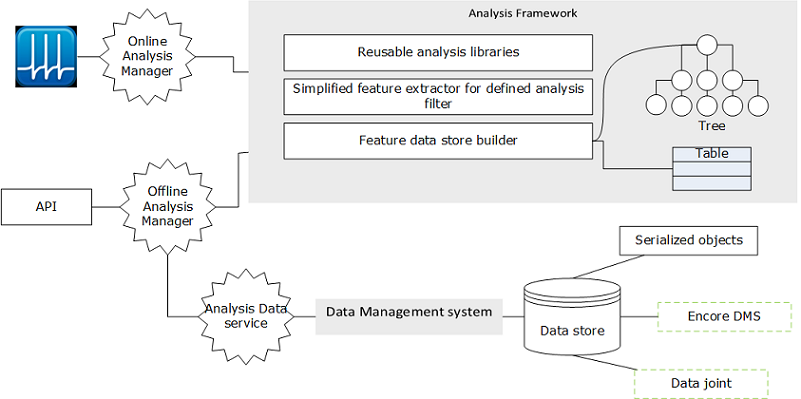

# Data Analysis

Data analysis toolbox for Multi-electrode patch clamp recordings. It is designed to supports both online and offline analysis by using shared libraries and data structure.

The core analysis framework lives in [sa-labs-analysis-core](https://github.com/Schwartz-AlaLaurila-Labs/sa-labs-analysis-core) and facilitates the data storage and sharing.

The common analysis functions will be in [sa-labs-util](https://github.com/Schwartz-AlaLaurila-Labs/sa-labs-util.git)

The master configuration for managing cell class, cell types, etc are present in [sa-labs-analysis-preference](https://github.com/Schwartz-AlaLaurila-Labs/sa-labs-analysis-preference.git)

### Installation

1. Download and install [ToolboxToolbox](https://github.com/ToolboxHub/ToolboxToolbox)
2. Restart Matlab
3. `git clone https://github.com/Schwartz-AlaLaurila-Labs/sa-labs-analysis.git` into `<userpath>\projects\sa-labs-analysis` folder 
4. open the matlab command window and run `tbUseProject('sa-labs-analysis')`

### Folder organization

1. It follows maven style source code organization
2. All the dependency will be present in toolbox folder

### Data Flow and managemnt

### Usage

TODO API documentation

### Requirements

- Matlab 2016a+
- [ToolboxHub](https://github.com/ToolboxHub/ToolboxToolbox) for dependency 
management

### Matlab dependencies
    
     sa-labs-analysis
        |
        |____ sa-labs-analysis-core
        |    
        |____ sa-labs-util       
        |    
        |____ sa-labs-analysis-preference
        |    
        |____ app-toolboxes

