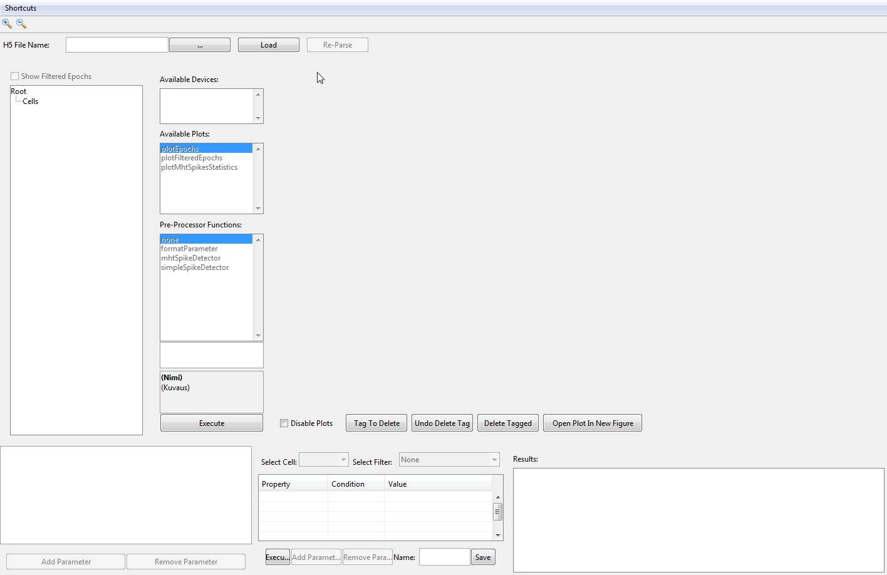

# Data Analysis

Data analysis toolbox for Multi-electrode patch clamp recordings. It is designed to supports both online and offline analysis by using shared libraries and data structure.

### 1. Data Curator



### 2. Analysis Pipeline

```Matlab

%% Create the analysis project
% --------------------------------------------
clear;
[project, offlineAnalysisManager] = createAnalysisProject('Example-Analysis_01',...
    'experiments', {'101217Dc*Amp2'},...
    'override', true);
% open the project file
open(project.file)

%% Create a simple search tree definition
% --------------------------------------------
analysisFilter = struct();
analysisFilter.type = 'LightStepAnalysis';
analysisFilter.buildTreeBy = {'displayName', 'intensity', 'stimTime'};
analysisFilter.displayName.splitValue = {'Light Step'};
analysisFilter.stimTime.featureExtractor = {@(analysis, epochGroup, analysisParameter)...
     sa_labs.analysis.common.extractors.psthExtractor(...
     analysis,...
     epochGroup,...
     analysisParameter)...
    };

%% Build the tree based on the tree definition
% --------------------------------------------
buildAnalysis('Example-Analysis_01', analysisFilter)

```

### 3. Tree Browser


## Usage

[GitBook doc](https://ala-laurila-lab.gitbooks.io/sa-labs-analysis-docs/content/)

* [Introduction](https://github.com/Schwartz-AlaLaurila-Labs/sa-labs-analysis-docs/blob/master/README.md)
* [Getting Started](https://github.com/Schwartz-AlaLaurila-Labs/sa-labs-analysis-docs/blob/master/getting-started.md)
* [Parsing your data](https://github.com/Schwartz-AlaLaurila-Labs/sa-labs-analysis-docs/blob/master/parsing-your-data.md)
  * [Data curator features](https://github.com/Schwartz-AlaLaurila-Labs/sa-labs-analysis-docs/blob/master/parsing-your-data/data-curator-features.md)
* [Building analysis pipeline](https://github.com/Schwartz-AlaLaurila-Labs/sa-labs-analysis-docs/blob/master/building-analysis-pipeline.md)
  * [Creating feature extractor](https://github.com/Schwartz-AlaLaurila-Labs/sa-labs-analysis-docs/blob/master/building-analysis-pipeline/creating-feature-extractor.md)
* [Visualizing your results](https://github.com/Schwartz-AlaLaurila-Labs/sa-labs-analysis-docs/blob/master/visualizing-your-results.md)
* [Dependency](https://github.com/Schwartz-AlaLaurila-Labs/sa-labs-analysis-docs/blob/master/documentation/dependency.md)

### Folder organization

- The core analysis framework lives in [sa-labs-analysis-core](https://github.com/Schwartz-AlaLaurila-Labs/sa-labs-analysis-core) and facilitates the data storage and sharing.
- The common analysis functions will be in [sa-labs-util](https://github.com/Schwartz-AlaLaurila-Labs/sa-labs-util.git)
- The master configuration for managing cell class, cell types, etc are present in [sa-labs-analysis-preference](https://github.com/Schwartz-AlaLaurila-Labs/sa-labs-analysis-preference.git)
- It follows maven style source code organization
- All the dependency will be present in toolbox folder

MIT License

Copyright (c) 2017 Schwartz-AlaLaurila-Labs

